# Howto

This guide contains a brief howto on using this extension with an eIDAS node which supports 
the extended SAML v2.0 described in the [eIDAS+eID+Profile](https://ec.europa.eu/cefdigital/wiki/display/CEFDIGITAL/eIDAS+eID+Profile).

## Assumptions 

We assume that you already have a keycloak instance running at `https://keycloak.domain` and you 
have installed this extension by copying the jar file to `$KEYCLOAK_HOME/standalone/deployments/`. We are going to 
work in a realm called `eidrealm`.

Your keycloak installation will play the role of the service provider (SP). You will need to acquire a X.509 certificate which contains the proper common name (CN) and country code (C). Depending on the eIDAS node that you are trying to connect, it might be a requirement that the SP country and the eIDAS node country at the same. 

## SP (Keycloak) Certificate

For this guide we are going to use Greece as an example, and we are going to produce a self-signed certificate for our 
keycloak installation. Start by generating a private key: 

```
openssl genrsa -out keycloak.domain.key 4096
```

And then generate a self-signed certificate:

```
openssl req -new -subj "/C=GR/ST=keycloak/L=keycloak/O=keycloak/OU=keycloak/CN=keycloak.domain" -days 365 -nodes -x509 -sha384 -key keycloak.domain.key -out keycloak.domain.crt
```

## Keycloak Realm Setup

### New realm

Go to keycloak's admin page `https://keycloak.domain/auth` and create a new realm called `eidrealm`.

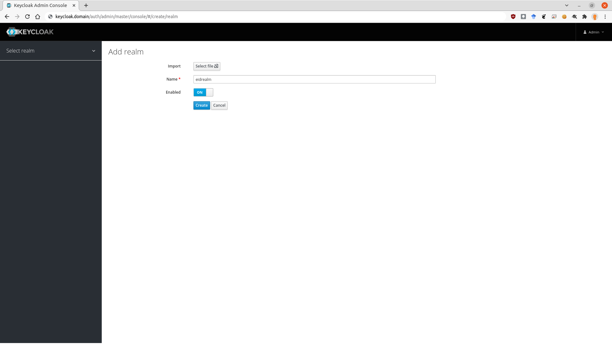

### Key providers

Now go to `Realm Settings->Keys->Providers` in order to add the previously generated private key and certificate.

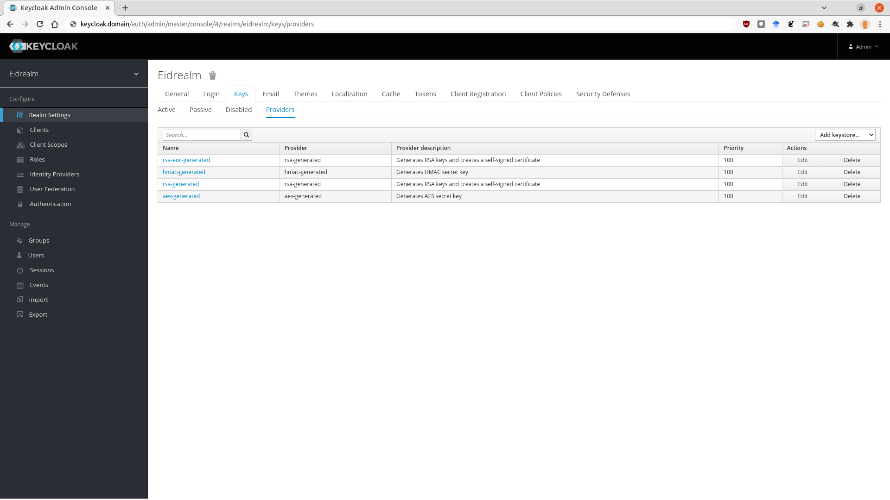

Clik on `Add keystore` and select an `rsa` keystore. Use a higher priority than the other providers (say 150) or 
make sure to disable or delete the other providers. Select the private key `keycloak.domain.key` and certificate `keycloak.domain.crt` that you have for 
keycloak and press save.

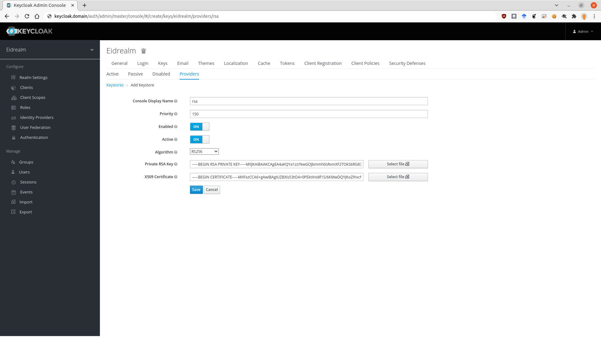

### IdP - Basic Settings

Switch to `Identity Providers` and add a new provider of type `eIDAS SAML v2.0`. You will see the settings for the new provider. It contains all SAML v2.0 options and a few specific for eIDAS located at the bottom. Note that the eIDAS specification is strict in what configurations are allowed.

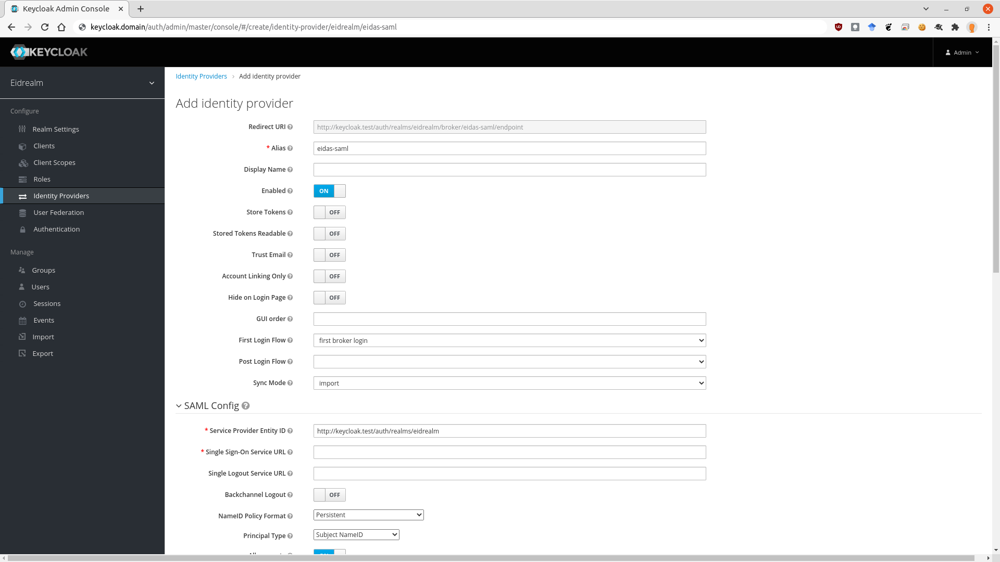

Set at least the following settings: 
  * Service Provider Entity ID: Here you need to use the url that returns the metadata of the SP. In our case this is `https://keycloak.domain/auth/realms/eidrealm/broker/eidas-saml/endpoint/descriptor`. Make sure to open this url in order to see the metadata. 
  * Single Sign-On Service URL: This is the eIDAS node service url. Set it according to the guide of the eIDAS node you want to connect, i.e. `https://eidas.domain/SpecificConnector/ServiceProvider`.
  * Set `Allow create` to `ON`.
  * Set `HTTP-POST Binding Response` to `ON`
  * Set `HTTP-POST Binding for AuthnRequest` to `ON`
  * Set `Want AuthnRequests Signed` to `ON`
  * Set `Want Assertions Encrypted` to `ON`
  * Set `Signature Algorithm` to `RSA_SHA512_MGF1`
  * Set `Force Authentication` to `ON`
  * Set `Validate Signature` to `ON`
  * Open the metadata url of the eIDAS node, i.e., `https://eidas.domain/SpecificConnector/ConnectorResponderMetadata` and copy-paste the X.509 certificate from `md:IDPSSODescriptor` for signing.
  * Paste the previous X.509 to `Validating X509 Certificates`.
  * Set `Sign Service Provider Metadata` to `ON`

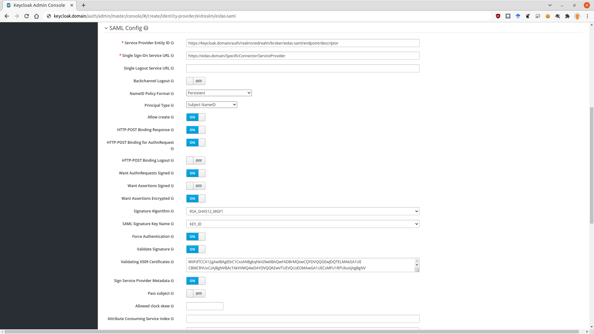

### IdP - eIDAS Specific Settings

  * Open the `Requested AuthnContext Constraints` subsection
  * Set `Comparison` to `Minimum`
  * Go to `eIDAS SAML Extensions Config`
  * You can optionally set `Service Provider Country of Origin` to the country of the SP (keycloak). If set the country code will be exported in the metadata under the SPSSO role.
  * Set `Level of Assurance` to the level of assurance you want, i.e. `http://eidas.europa.eu/LoA/low`. The level of assurance can also be set directly using the `AuthnContext ClassRefs`. This option is just a shortcut.
  * If the service is from the private sector set `Private sector service provider` to `ON` otherwise the service will be from the public sector by default.
  * Set `Requested Attributes` to the ones you need. The format for the requested attributes is a json array of objects. See the example below:
 
  ```
  [{"Name":"http://eidas.europa.eu/attributes/naturalperson/PersonIdentifier", 
    "NameFormat":  "urn:oasis:names:tc:SAML:2.0:attrname-format:uri", "isRequired":true
   }, 
   {"Name":"http://eidas.europa.eu/attributes/naturalperson/CurrentFamilyName",
    "NameFormat":  "urn:oasis:names:tc:SAML:2.0:attrname-format:uri", "isRequired":true},
   {"Name":"http://eidas.europa.eu/attributes/naturalperson/CurrentGivenName",
    "NameFormat": "urn:oasis:names:tc:SAML:2.0:attrname-format:uri", "isRequired":true},
   {"Name":"http://eidas.europa.eu/attributes/naturalperson/DateOfBirth",
    "NameFormat": "urn:oasis:names:tc:SAML:2.0:attrname-format:uri", "isRequired":true},
   {"Name":"http://eidas.europa.eu/attributes/naturalperson/Gender",
    "NameFormat": "urn:oasis:names:tc:SAML:2.0:attrname-format:uri", "isRequired":false}
  ]
  ```
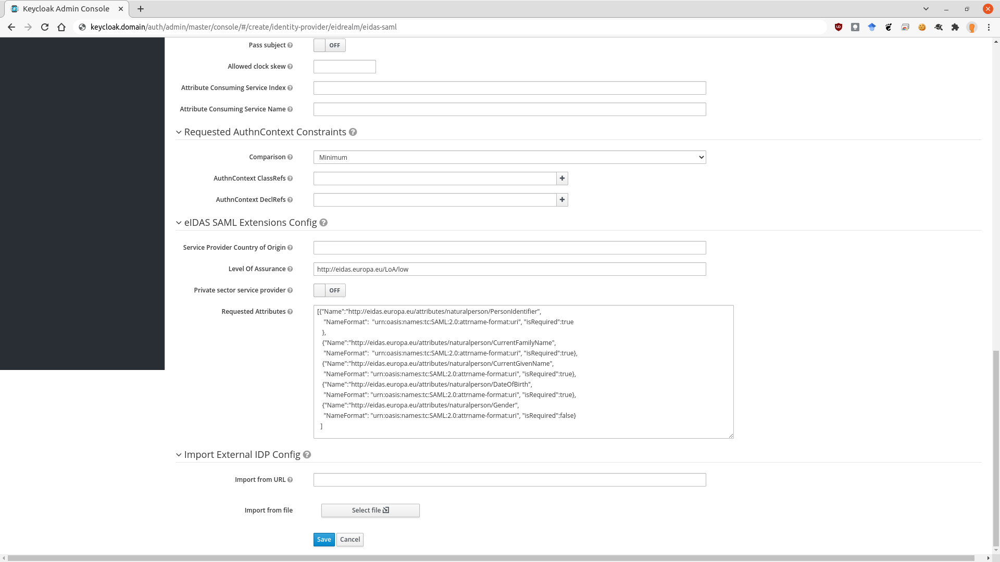

Finally press save.

### IdP - Mappers

Switch to mappers. We need to add at least one mapper in order to create the broker id for federated user lookup. 

  * Create a `Username Template Importer` with Template equal to `${ALIAS}.${ATTRIBUTE.PersonIdentifier}` and Target `BROKER_ID`. The important here is to use the PersonIdentifier since it uniquely identifies a user by prepending country codes.

    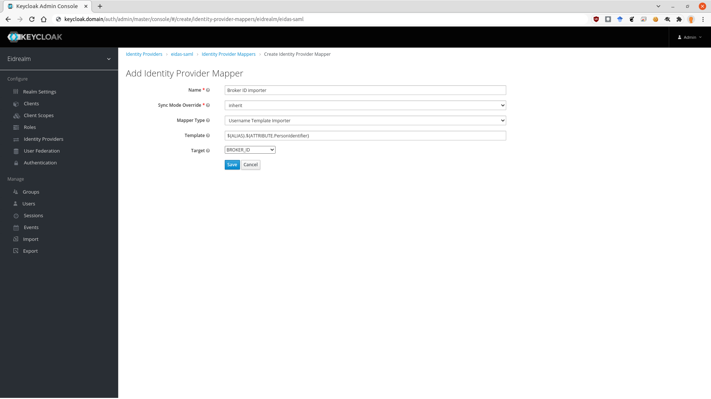

  * Optionally create `Username Template Importer` for the LOCAL username and the BROKER_USERNAME. 

    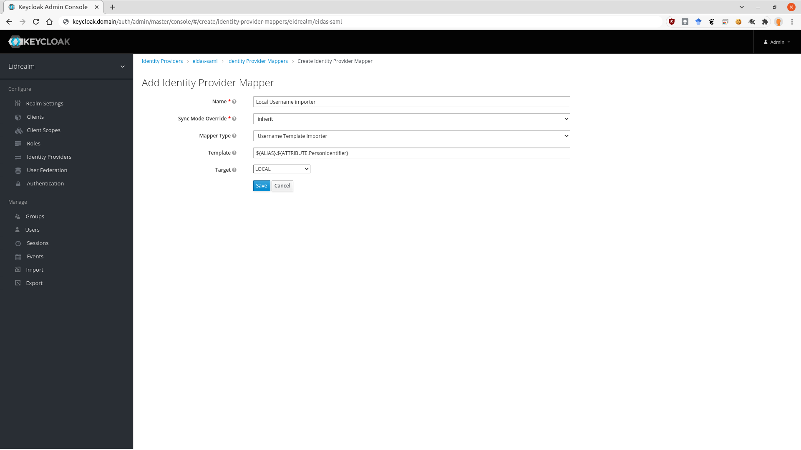

  * Optionally create `Attribute Importer` mappers in order to map attributes. 

    

### Authentication - Flows

Switch to `Authentication` and copy the default `Browser` flow to a flow called `eIDAS Browser`.

  * Remove all flows besides the Cookie flow.

    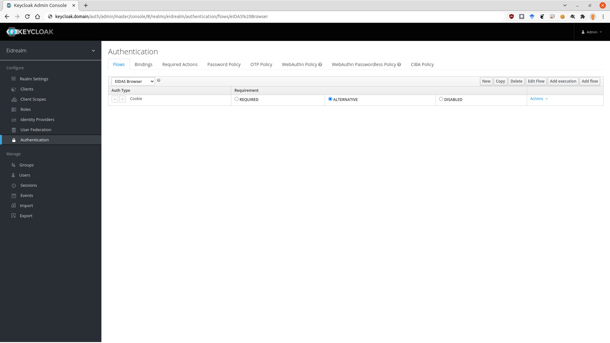

  * Add flow `eIDAS` and set it as `ALTERNATIVE`.

    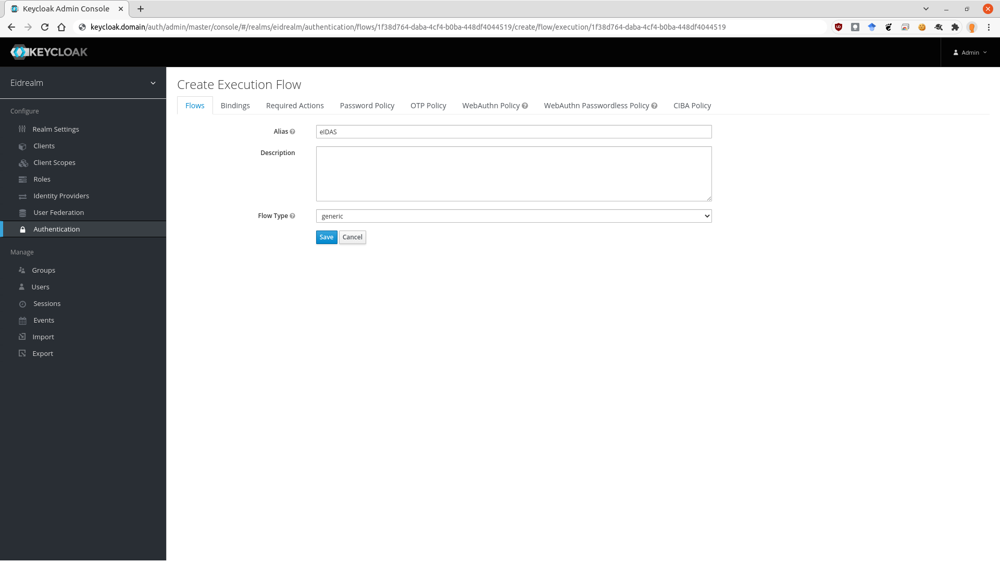    

  * Go to `eIDAS` Actions and add an `execution` of provider `Citizen Country Selection`. 

    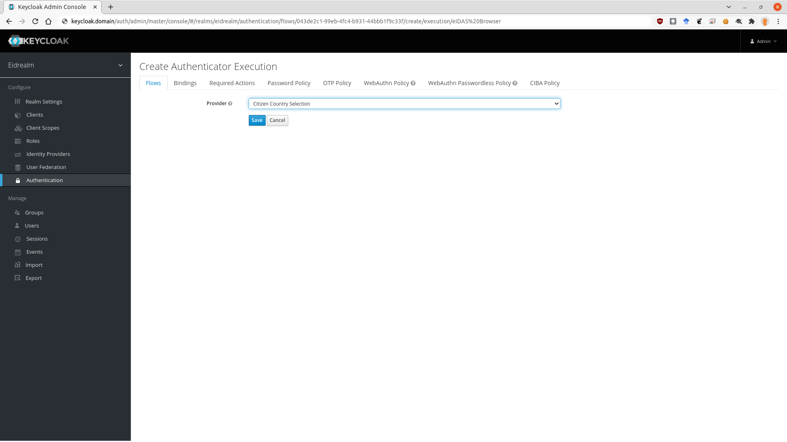        

  * Set `Citizen Country Selection` as `REQUIRED` and go to `Actions->Config` and create a country list. These countries will be available in the displayed form during login. 

    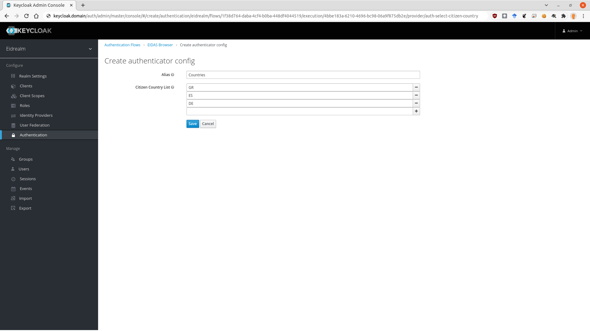            

  * Go to `eIDAS` Actions and add an `execution` of provider `Identity Provider Redirector`.     

    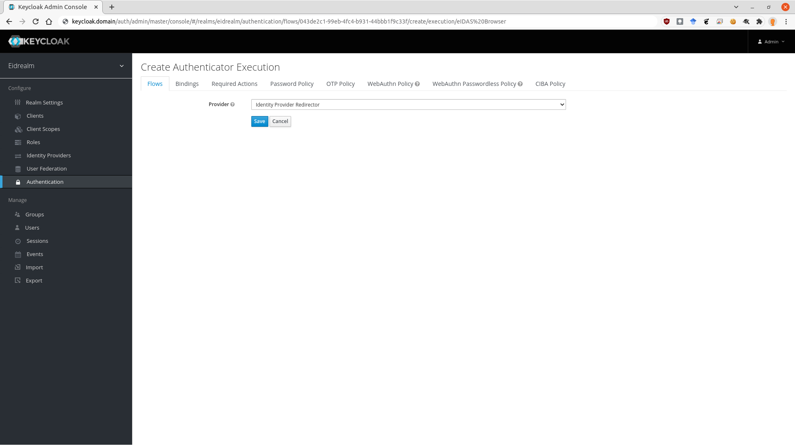      

* Set `Identity Provider Redirector` as `REQUIRED` and go to `Actions->Config` and set the `Default Identity Provider` to `eidas-saml`.

    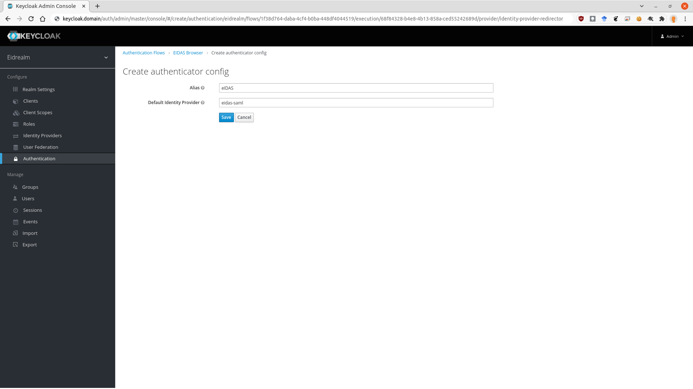          

* The final flow should look like the following.  

    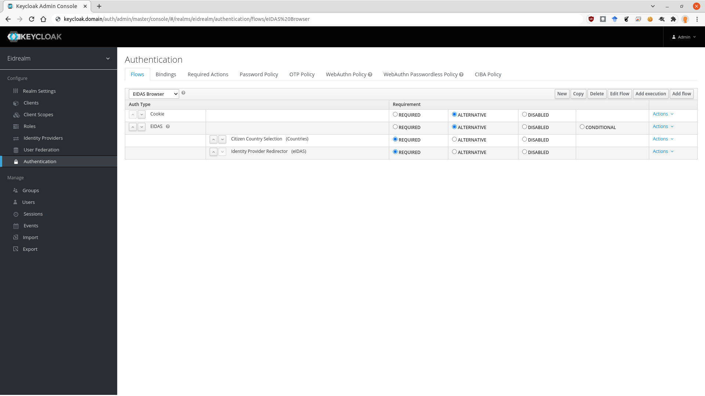              

* Go to `Authentication->Bindings` and set as `Browser Flow` the 
  `eIDAS Browser`. 

### Clients

Set the necessary clients in order to connect. If you want to test the setup without creating a new client you can use the `account-service`. Just point your browser at `https://keycloak.domain/auth/realms/eidrealm/account` and press `Sign In`.